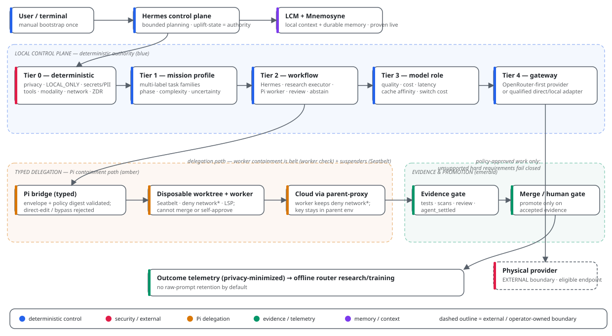
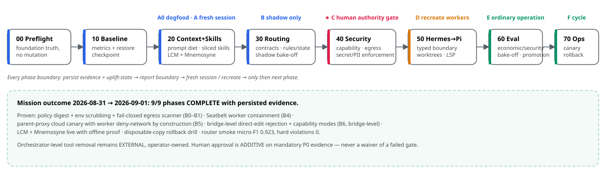

# Hermes + Pi Agentic Stack

AI coding assistants are powerful but hard to trust with real work: they can leak secrets, take shortcuts, and quietly edit production code. This project fixes that with two roles. **Hermes** ([NousResearch/hermes-agent](https://github.com/NousResearch/hermes-agent)) is the boss: a local orchestrator that plans, routes, and checks. **Pi** ([earendil-works/pi](https://github.com/earendil-works/pi)) is the hands: a sandboxed coding worker that can't reach the network, can only write inside a disposable copy of the repo, and returns every change through a review gate. Every request passes checked, deterministic safety rules *before* any cloud model ever sees it — and all of it runs on your own machine first.

This repository is the control blueprint for that stack: how to install it, how each piece is verified, and the evidence that it works.

Target workstation: Apple Silicon / MacBook Pro M3 Max 128 GB while preserving headroom for normal browser/build/LSP/container work.



> **Status: uplift mission COMPLETE.** All 9 phases (00–70) executed **2026-08-31 → 2026-09-01** with persisted evidence: **9/9 COMPLETE**. What was proven end-to-end:
>
> - **Sandboxed coding worker** — every coding task is handed to Pi as a signed, replay-safe request; on macOS it runs under Seatbelt with the network denied and writes confined to a disposable copy of the repo (typed v2.2 envelopes, policy-digest binding, `agent_settled` completion).
> - **Fail-closed egress scanner** — secrets/PII/cloud-ineligible content is blocked, never dropped silently; worker-direct egress impossible by construction (parent-proxy is the only cloud path).
> - **Bypass attempts structurally rejected** (Phase 70) — direct-edit/bypass envelopes are rejected by code before a worker even starts; cloud egress default-denied.
> - **Proven rollback drill** (restored from a disposable copy); LCM (local context memory) + Mnemosyne (long-term memory) live with an offline proof.
> - **Router baseline:** rules smoke micro-F1 **0.923**, hard violations **0**; **26/26 tests green**; routine capability probes **46% faster** than baseline.
>
> Honest boundary: orchestrator-level removal of Hermes' own generic tools remains **EXTERNAL, operator-owned** (this Hermes version exposes no permissions/hooks config keys) — see [`docs/agentic-uplift/bootstrap-authority.md`](docs/agentic-uplift/bootstrap-authority.md).



## Quick start

- **For humans:** start at [`docs/agentic-uplift/fresh-install-bootstrap.md`](docs/agentic-uplift/fresh-install-bootstrap.md) (a step-by-step install guide), then run the pre-written uplift mission — a build script the agent executes phase by phase — with `uplift chat --query-file UPLIFT_MISSION.md`.
- **For agents:** start at [`UPLIFT_MISSION.md`](UPLIFT_MISSION.md) — the instruction set the agent follows (humans: read the Fresh Install guide instead) — load only the current slice from [`skills/hermes-stack-uplift/SKILL.md`](skills/hermes-stack-uplift/SKILL.md), and honor the durable-state contract in [`docs/agentic-uplift/agent-execution-contract.md`](docs/agentic-uplift/agent-execution-contract.md). Re-executing the uplift starts from Phase 00 against your own environment; this repository is the blueprint, not your mission state.

## What the uplift proved (and keeps proving)

Two missions have run against this blueprint, and both published their evidence here:

1. **Stack uplift (2026-08-31 → 2026-09-01, 9/9 phases).** Installed, verified and
   promoted the whole stack you see described in this README — sandboxed Pi workers,
   fail-closed egress scanning, tiered routing, local memory. See the mission-lifecycle
   diagram above and `docs/agentic-uplift/validation-report.md`.
2. **Context-management uplift (2026-09-01 → 2026-09-02, CM-00..CM-80).** Asked: *can the
   agent's own memory stay cheap, fast, and honest as conversations grow?* Answer: yes —
   with two settings promoted after a clean 9-run bake-off showed no quality loss and no
   stalls. The reusable pieces for future engineers: the execution skill
   ([`skills/hermes-stack-uplift/context-management-execution/SKILL.md`](skills/hermes-stack-uplift/context-management-execution/SKILL.md)),
   the benchmark corpus pattern
   ([`skills/hermes-stack-uplift/hermes-stack-uplift-lessons/references/context-management-corpus.md`](skills/hermes-stack-uplift/hermes-stack-uplift-lessons/references/context-management-corpus.md)),
   and the host lessons file
   ([`skills/hermes-stack-uplift/hermes-stack-uplift-lessons/SKILL.md`](skills/hermes-stack-uplift/hermes-stack-uplift-lessons/SKILL.md)).

> A note on the word *evidence*: throughout this repo, "evidence" means a file produced
> by a real command run — a test result, a measurement, a log — that anyone can re-run to
> check the claim. Claims without an evidence file are treated as unproven.

## Architecture at a glance

```text
MISSION + durable state
        |
        v
Hermes control plane + local LCM/Mnemosyne
        |
        v
Tier 0 — deterministic eligibility/security
privacy | LOCAL_ONLY | PII/secrets | tools | modality | context | network/sandbox | ZDR (Zero Data Retention — provider keeps nothing) | review
        |
        v
Tier 1 — multi-label mission profile
tasks | domain | phase | complexity | uncertainty | reasoning/tool intensity
        |
        v
Tier 2 — bounded workflow / agent
Hermes | research executor | Pi worker | review worker | local tools | multi-stage | abstain
        |
        v
Tier 3 — eligible model-role / model optimization
quality | cost | latency | reliability | cache affinity | switch cost
        |
        v
Tier 4 — OpenRouter-first gateway
        |
        v
eligible physical provider / qualified direct or local adapter
        |
        +--> information / synthesis / reasoning / review stage
        `--> typed Hermes -> Pi -> disposable worktree / sandbox / LSP
                                      |
                                      v
                               tests / scans / review / merge gate
        |
        v
privacy-minimized outcome telemetry -> offline router research/training
```

**Research and coding are first-class task families, not the routing ontology.** A mission such as:

```text
research -> architecture/design -> implementation -> tests -> security review
```

is represented as ordered stages instead of one `hybrid` label.

The stable seams are [`protocols/routing-mission.schema.json`](protocols/routing-mission.schema.json) and [`protocols/routing-decision.schema.json`](protocols/routing-decision.schema.json). Hermes/Pi/OpenRouter semantics do not depend directly on a particular router framework.

### Routing responsibilities

- **Tier 0:** deterministic/local hard eligibility. A learned model cannot override `LOCAL_ONLY`, secret/PII policy, known tool/modality/context/network/sandbox requirements or policy-required approval/review.
- **Tier 1:** infer task families/domain/phase/complexity/uncertainty/intensity.
- **Tier 2:** choose a bounded workflow/agent path.
- **Tier 3:** select among eligible model roles/models using measured quality/economics.
- **Tier 4:** OpenRouter normally chooses the physical provider for the already-approved model/request.

OpenRouter Auto is a bounded bootstrap/shadow/fallback/teacher signal only; it is never privacy, capability or final workflow authority. Direct Z.ai/DeepSeek/local adapters remain replaceable Tier-4 challengers.

---

# Fresh Install: Manual Bootstrap

The human establishes the foundation once. Hermes then takes over **one observable phase at a time**.

Full instructions: [`docs/agentic-uplift/fresh-install-bootstrap.md`](docs/agentic-uplift/fresh-install-bootstrap.md).

## 0. Bootstrap boundary

A Hermes profile is **not a sandbox**. Preferred: use a dedicated **Standard (non-admin)** macOS account without production/customer repositories, unrelated credentials or sensitive SSH material. A normal developer account is a trusted-bootstrap fallback, not zero-trust isolation.

## 1. Install current Hermes

```bash
curl -fsSL https://hermes-agent.nousresearch.com/install.sh | bash
source ~/.zshrc
hermes --version
```

## 2. Clone the repo

```bash
mkdir -p ~/src
cd ~/src
git clone https://github.com/thepragmatik/hermes-pi-agentic-stack.git
cd hermes-pi-agentic-stack
STACK_REPO="$(pwd -P)"
git status --short
git rev-parse HEAD
```

The repository is public at this snapshot, so a read-only HTTPS clone needs no GitHub credential. Never paste write credentials into Hermes/chat/docs.

## 3. Create a minimal Hermes profile

```bash
hermes profile create uplift --no-skills \
  --description "Controlled Hermes + Pi staged self-uplift orchestrator."
hermes profile show uplift
uplift setup
```

Choose **Blank Slate**. Do not clone an old Hermes profile/home/session database or enable a broad skill/plugin/MCP catalogue.

## 4. Configure OpenRouter + one bootstrap model

```bash
uplift model
```

Choose OpenRouter, enter its API key only through Hermes' provider setup, select the current GLM-Flash-class bootstrap candidate and record the exact resolved ID. Snapshot evidence is not a timeless model binding.

Preferred initial external credential footprint:

```text
OPENROUTER_API_KEY
```

Do not add direct-provider credentials yet.

## 5. Expose only the uplift skill and create durable state

```bash
cd "$STACK_REPO"
uplift config set terminal.cwd "$STACK_REPO"
PROFILE_CONFIG="$(uplift config path)"
PROFILE_HOME="$(dirname "$PROFILE_CONFIG")"
mkdir -p "$PROFILE_HOME/skills" "$PROFILE_HOME/uplift/evidence" "$PROFILE_HOME/uplift/checkpoints"
ln -sfn "$STACK_REPO/skills/hermes-stack-uplift" "$PROFILE_HOME/skills/hermes-stack-uplift"
uplift skills list
```

Runtime state belongs at `$PROFILE_HOME/uplift/uplift-state.json` and validates against `protocols/uplift-state.schema.json`. Chat is not state.

Run:

```bash
uplift config check
uplift doctor
uplift dump
uplift config get model --json
git -C "$STACK_REPO" status --short
git -C "$STACK_REPO" rev-parse HEAD
```

Record versions, repo SHA, isolation mode, OpenRouter provider/model ID, policy digest and rollback path—never the API key.

---

# START THE UPLIFT

```bash
cd "$STACK_REPO"
uplift chat --query-file UPLIFT_MISSION.md
```

[`UPLIFT_MISSION.md`](UPLIFT_MISSION.md) requires Hermes to read durable state/contract first, load only the current skill slice, execute one bounded phase, persist evidence, report the boundary and stop.

## Iterative lifecycle

| Phase | Bounded objective | Adoption boundary |
|---|---|---|
| **00 Preflight** | environment/version/repo/policy/provider/isolation truth | none |
| **10 Baseline + Backup** | before metrics, restore checkpoint, optional read-only legacy salvage | none normally |
| **20 Context + Skills** | prompt diet + sliced skills, then LCM+Mnemosyne + Spec Kit projection | **A0:** dogfood slimming before memory layering; **A:** fresh optimized session |
| **30 Routing** | routing contracts, rules/state baseline, shadow semantic/framework bake-off | **B:** shadow only |
| **40 Security + Policy** | structural capability/egress/secret/PII/sandbox enforcement | **C:** human authority gate |
| **50 Hermes->Pi + LSP** | typed stage/task boundary, containment, worktrees, LSP, coding cutover | **D:** recreate disposable workers |
| **60 Evaluation + Promotion** | matched outcome/economic/security bake-off and router/model promotion | **E:** ordinary multi-workflow/multi-role operation |
| **70 Upgrades + Rollback** | recurring canary/update/restart/rollback discipline | **F:** maintenance cycle |

### First dogfooding benefit

Inside Phase 20, **Dogfood Gate A0** applies only the context/prompt/skill slimming, starts a fresh Phase-20 continuation, runs a matched baseline subset and repairs/rolls back before adding LCM/Mnemosyne if quality regresses. This preserves causal attribution and gives Hermes an early reversible self-benefit.

After full Phase 20 passes Hermes reports:

> **The first token/context improvements are ready to use.**

Then Phase 30 begins in another fresh optimized session.

---

# Routing progression

The fresh bootstrap does **not** depend on a sophisticated router.

```text
Phases 00-20: one explicit bootstrap model via OpenRouter
        |
Phase 30: deterministic eligibility + rules/state + abstain
        |
shadow challengers:
  minimal embeddings
  Aurelio Semantic Router
  vLLM Semantic Router
  LLMRouter research algorithms
  RouteLLM-style Tier-3 scoring
  OpenRouter Auto sanitized shadow
        |
collect real Hermes/Pi outcomes
        |
Phase 60: promote only what improves accepted-mission economics/security
        |
later ModernBERT multi-head model only if data/evidence earns it
```

### Current framework assessment

| Candidate | Intended role | Current posture |
|---|---|---|
| deterministic rules/state | hard baseline + simple Tier 1/2 | **initial router** |
| Aurelio Semantic Router | lightweight local semantic component | shadow challenger |
| **vLLM Semantic Router** | richer signal/session/model-routing control plane | **strongest medium-term adoption candidate**; adapter/config/upstream first |
| RouteLLM | strong-vs-economical Tier-3 scorer | optional research/second stage |
| LLMRouter | algorithm/evaluation laboratory | research plane only |
| OpenRouter Auto | shadow teacher/bootstrap/fallback | never security/workflow authority |
| ModernBERT | future multi-label/multi-head learner | do not train prematurely |

See [`docs/agentic-uplift/research/local-routing-models.md`](docs/agentic-uplift/research/local-routing-models.md).

## ModernBERT evidence gate

Do **not** train `research|coding|hybrid`.

A later ModernBERT may output calibrated task families, domains, workflow phase, complexity, reasoning/tool intensity, context-need band and uncertainty. Fine-tuning requires representative locally redacted/deduplicated real Hermes missions, multi-stage coverage, matched workflow/model/provider outcomes, clean mission/repository/session/time holdouts, stable learning curves/calibration and evidence that simpler rules/embedding/Aurelio/vLLM-config approaches have plateaued on **routing regret / cost per accepted mission**.

If simpler routing captures most economic benefit, keep it simple.

---

# OpenRouter-first, direct-provider-capable

Our stack chooses:

```text
hard eligibility -> workflow -> model role -> model -> abstract provider requirements
```

OpenRouter normally handles physical-provider routing/failover for that eligible model. Its raw API can provide provider allow/deny/order, parameter/data/ZDR filters, price/latency/throughput preferences, model fallbacks and session/provider stickiness. The installed Hermes client currently exposes only a subset, so unsupported hard requirements must be enforced by account policy/a thin audited adapter or fail closed—not silently discarded.

A direct-provider or local MLX adapter implements the same Tier-4 contract. It is promoted only if matched **cost per accepted mission**, quality, latency, cache, reliability, privacy or capability evidence justifies another credential/integration path.

See [`docs/agentic-uplift/research/openrouter-routing.md`](docs/agentic-uplift/research/openrouter-routing.md).

---

# Router bake-off and outcome learning

[`tools/router-bench/`](tools/router-bench/) now evaluates a multi-capability mission corpus rather than five provider/land labels.

It separates:

- multi-label task/profile inference;
- deterministic eligibility violations;
- workflow selection;
- router latency/RSS/determinism;
- optional matched real outcome economics.

Primary system metric is much closer to:

```text
cost per accepted mission
```

including retries, latency, capability failures, switching/cache effects and human override.

Privacy-minimized future telemetry may record mission/profile hashes/features, routing engine/version, workflow/model/provider, tokens/cached tokens, TTFT/wall time, tools/retries/fallbacks/switches, tests/review, human override, accepted/rejected outcome, failure reason and cost. Raw sensitive prompts are not the default evidence/training store.

---

# Context, memory and security ownership

```text
LCM             = current-session exact context + compaction recovery
Mnemosyne       = curated cross-session durable memory
state.db        = raw Hermes history / forensic search
uplift-state    = deterministic mission authority
routing-mission = framework-neutral routing input
routing-decision= framework-neutral routing output
T2 artifacts    = raw logs/diffs/benchmarks/test evidence
Git/ADR/spec    = project truth
Kanban          = optional operational projection
```

Security-critical controls live outside prompts/context/memory/learned routing/OpenRouter. The 2026-08-31 → 2026-09-01 mission proved the bridge-level and containment layers (egress fail-closed, Seatbelt, capability modes, rollback drill); orchestrator-level tool removal and OS-account isolation remain external, operator-owned steps.

---

# Start reading

1. [`docs/agentic-uplift/fresh-install-bootstrap.md`](docs/agentic-uplift/fresh-install-bootstrap.md)
2. [`UPLIFT_MISSION.md`](UPLIFT_MISSION.md)
3. [`docs/agentic-uplift/implementation-playbook.md`](docs/agentic-uplift/implementation-playbook.md)
4. [`docs/agentic-uplift/agent-execution-contract.md`](docs/agentic-uplift/agent-execution-contract.md)
5. [`docs/agentic-uplift/research/local-routing-models.md`](docs/agentic-uplift/research/local-routing-models.md)
6. [`tools/router-bench/README.md`](tools/router-bench/README.md)
7. [`docs/agentic-uplift/research/openrouter-routing.md`](docs/agentic-uplift/research/openrouter-routing.md)
8. [`docs/agentic-uplift/artifact-usability-review.md`](docs/agentic-uplift/artifact-usability-review.md)
9. [`docs/agentic-uplift/adversarial-review.md`](docs/agentic-uplift/adversarial-review.md)
10. [`docs/agentic-uplift/validation-report.md`](docs/agentic-uplift/validation-report.md)

Human site: **https://thepragmatik.github.io/hermes-pi-agentic-stack/**

Agents start at `llms.txt` / `agent/START.md` on the published site (https://thepragmatik.github.io/hermes-pi-agentic-stack/llms.txt — generated by `tools/site/build_site.py`, not checked into this repo) and fetch only the current slice.
