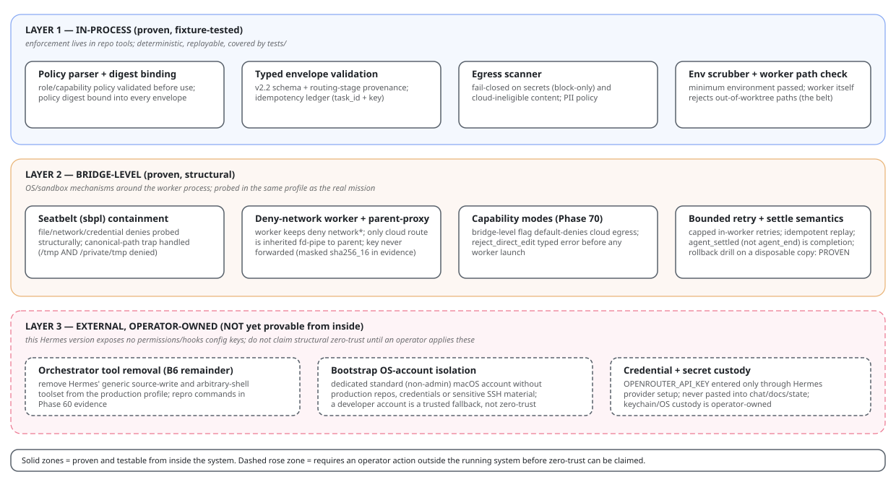

# Architecture — Canonical Text Representation

This Markdown plus `architecture.graph.json` is canonical for deterministic agent/reviewer interpretation. SVG/HTML diagrams are presentation views only; where this text and a diagram disagree, the text and graph win.

Presentation views:

(The mission-lifecycle diagram is embedded in `implementation-playbook.md`; the Pi bridge request flow in `bootstrap-authority.md`.)

## Components and trust boundaries

Think of a request as passing through a series of gates, in order: *Is this allowed to leave the machine? What kind of task is it? Who should do it? Which model? Which provider?* Each tier below answers one of those questions; the detailed list is the authoritative version.

1. **Terminal/User** performs the minimal manual bootstrap and submits the staged mission to Hermes.
2. **Hermes control plane** owns bounded workflow planning, delegation and review. Temporary direct bootstrap authority is canary-scoped; steady-state orchestrator authority cannot bypass Pi for production coding.
3. **LCM + Mnemosyne** provide local current-session context recovery and curated cross-session durable memory (LCM keeps the current session's context intact; Mnemosyne is a local long-term memory the agent can search across sessions). Neither is execution/security authority.
4. **Tier 0 deterministic eligibility/policy** decides privacy/cloud eligibility, secrets/PII policy, required capabilities/tools/modality/context, sandbox/network restrictions, approval/review requirements and other hard constraints before learned/model/provider routing. This is the hard safety layer: rules enforced by code, not by prompt instructions a model could ignore.
5. **Tier 1 mission-profile inference** infers multi-label task families, domain, workflow phase, complexity, uncertainty and reasoning/tool intensity. Research and coding are first-class task families, not the complete ontology.
6. **Tier 2 workflow/agent selector** chooses a bounded execution path such as Hermes-only, research executor, Pi worker, review worker, local tool runner, multi-stage workflow or abstain/escalate. Ordered stages replace a crude `hybrid` class when the mission transitions between capabilities.
7. **Tier 3 model optimizer/binder** filters versioned model roles/models by capabilities/quality floor and scores eligible candidates using measured quality, cost, latency, reliability, context/cache affinity and switching cost.
8. **Tier 4 gateway adapter** defaults to OpenRouter. It receives only policy-approved work and translates abstract provider requirements into the gateway's supported provider policy. OpenRouter normally chooses the physical provider; direct-provider/local adapters remain replaceable alternatives.
9. **Research/review executor** runs selected information/synthesis/review stages through the chosen model role when cloud eligible.
10. **Pi bridge** validates a typed task envelope, routing-stage reference and policy digest, creates an isolated worktree/containment boundary and launches a bounded Pi worker.
11. **Pi worker** performs implementation/debug/refactor/test/DevOps tool loops using an eligible coding role and LSP servers; it cannot merge/self-approve.
12. **Evidence/review gate** runs tests, LSP fixtures, secret/PII/egress scans and required independent review.
13. **Merge/Human gate** promotes only accepted evidence according to maturity/approval policy.
14. **Durable uplift state** records phase/checkpoint/report/restart/adoption state independently of model context.
15. **Outcome telemetry** records privacy-minimized route/outcome/economic signals for offline bake-off/training; it is not raw-prompt memory by default.

## Routing contracts

The stable internal seam is framework-neutral:

1. [`protocols/routing-mission.schema.json`](protocols/routing-mission.schema.json) — mission profile + deterministic requirements + session + optimization
2. replaceable routing engine(s)
3. [`protocols/routing-decision.schema.json`](protocols/routing-decision.schema.json) — workflow stages + model role/model + gateway/provider requirements

Hermes/Pi/OpenRouter integration must not depend directly on Aurelio Semantic Router, vLLM Semantic Router, RouteLLM, LLMRouter or a future ModernBERT implementation.

## Core data flow

1. MISSION + durable state
2. Tier 0 — deterministic eligibility/security
3. Tier 1 — mission-profile inference
4. Tier 2 — workflow/agent selection
5. Tier 3 — model-role/model optimization
6. Tier 4 — OpenRouter/direct/local gateway adapter
7. policy-compatible physical execution
8. evidence/review/merge gate
9. privacy-minimized outcome telemetry

`LOCAL_ONLY` exits the cloud path at Tier 0. No later classifier/model/gateway can restore cloud eligibility.

## Multi-stage example

A mission such as `research -> architecture_design -> coding_implementation -> testing -> security_review` is represented as ordered stages with appropriate agents/model roles. It is not reduced to a single `hybrid` label.

## Router research vs production hot path

**Research/training plane:** LLMRouter / RouteLLM experiments and notebooks; OpenRouter Auto shadow comparisons; vLLM Semantic Router simulation/config experiments; ModernBERT fitting/fine-tuning. It exports versioned artifacts/config to:

**Production hot path:** deterministic Tier 0; the smallest measured Tier 1/2/3 engine that earns promotion; stable routing contracts.

The research plane may be heavy. The production hot path must remain local-before-cloud, bounded, auditable, abstention-safe and easy to roll back.

## Framework posture

- **Deterministic rules/state:** required baseline and Tier-0 authority.
- **Aurelio Semantic Router:** lightweight local Tier-1 semantic challenger/possible component.
- **vLLM Semantic Router:** strongest current medium-term adoption candidate for richer signal/projection/session/model-routing behavior, behind our contract; configure/upstream before considering a fork.
- **RouteLLM:** optional Tier-3 strong-vs-economical scorer, not mission ontology.
- **LLMRouter:** research/evaluation laboratory, not default hot-path dependency.
- **OpenRouter Auto:** sanitized shadow/bootstrap/fallback teacher signal only.
- **ModernBERT:** later multi-label/multi-head learner only after representative outcome data shows simpler candidates plateau.

## OpenRouter boundary

- **Our stack chooses:** `eligibility -> workflow -> model role -> model -> abstract provider requirements`.
- **OpenRouter normally chooses:** eligible physical provider / provider failover.

Raw OpenRouter provider capabilities are broader than current Hermes `provider_routing`. The gateway adapter must enforce required ZDR/session-affinity/performance semantics or fail closed; it may not silently discard a hard requirement because Hermes lacks a current config key.

OpenRouter Auto cannot override Tier 0 or replace our bounded workflow semantics.

## Bootstrap data flow

1. Clean narrow Hermes → OpenRouter → one verified bootstrap-class model
2. 00 preflight → 10 baseline
3. 20 context/skills + LCM/Mnemosyne → fresh session (Checkpoint A)
4. 30 rules/state router + semantic/vLLM/Auto shadow bake-off
5. 40 security authority gate
6. 50 typed Pi/LSP workers
7. 60 outcome/economic evaluation + router/model promotion
8. 70 recurring upgrades/rollback

The advanced router does not block early uplift.

## Context and state ownership

- **T0 stable prefix** — identity/invariants/small skill+tool catalogue
- **T1 mission capsule** — current bounded phase/objective/constraints/evidence pointers
- **T2 artifacts** — full logs/diffs/research/specs/benchmarks/RPC, fetched on demand
- **LCM** — current-session exact context/compaction recovery
- **Mnemosyne** — curated cross-session durable memory
- **state.db** — raw Hermes session history/forensic search
- **uplift-state** — deterministic mission authority
- **routing-mission / routing-decision** — current framework-neutral route input/output
- **Git/ADR/spec** — project truth
- **Kanban** — optional operational projection

Stable prompt prefix, workflow stage and model/provider should remain sticky within a phase/session when that improves cache continuity and behavioural consistency. Switching is a measured economic decision, not a default reaction to every short turn.

## Non-negotiable invariants

- Security/privacy/capability eligibility is enforced outside prompts, memory and learned routing.
- `LOCAL_ONLY` never enters OpenRouter or a direct cloud provider.
- Known tool/modality/context/network/sandbox requirements are deterministic eligibility facts.
- Task families are multi-label and workflows may be multi-stage; no `research|coding|hybrid` closed-world assumption.
- Routing engines are replaceable behind the mission/decision contracts.
- Hermes owns bounded workflow semantics/authority; no router framework becomes an unrestricted agent orchestrator.
- OpenRouter normally routes the downstream physical provider within policy; Auto is not privacy or workflow authority.
- Coding crosses the Hermes -> Pi typed boundary after authority cutover.
- Worker write/process/network/credential scopes are explicit and default-deny.
- Implementer cannot self-approve merge.
- Durable state, not conversation, determines phase/task execution and restart/adoption decisions.
- Outcome telemetry minimizes/raw-prompt retention and never substitutes for project truth.
- A phase ends with persisted evidence/report and returns control before the next phase.
- Upstream Hermes/Pi/LCM/Mnemosyne/router frameworks and model/provider bindings remain independently upgradeable/pinned.
